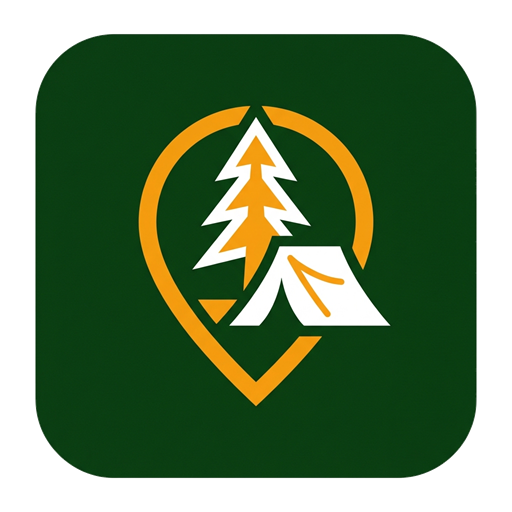

#  Zanocuj w Lesie – Lokator

**Zanocuj w Lesie** to nowoczesna aplikacja mobilna na system Android, stworzona z myślą o miłośnikach bushcraftu, survivalu i turystyki leśnej. Jej głównym celem jest natychmiastowe i w pełni niezawodne (również w trybie offline) udzielenie odpowiedzi na pytanie, czy użytkownik znajduje się wewnątrz oficjalnej strefy programu **„Zanocuj w lesie” (ZwL)** Lasów Państwowych, oraz jakie zasady bezpieczeństwa pożarowego obowiązują w danej lokalizacji.

---

## 🌲 Cel i Działanie Projektu

Aplikacja została zaprojektowana w myśl zasady **Offline-First**, ponieważ w głębi lasu zasięg sieci komórkowej jest często ograniczony lub niedostępny. 

* **W strefie:** Interfejs przybiera bezpieczną, zieloną oprawę, informując o nazwie nadleśnictwa, stopniu zagrożenia pożarowego (od 0 do 3) oraz o tym, czy dozwolone jest używanie turystycznych kuchenek gazowych.
* **Poza strefą:** Interfejs zmienia się na ostrzegawczy (żółto-pomarańczowy) i działa jako nawigator – wskazuje precyzyjną odległość do najbliższego obszaru legalnego biwakowania oraz fizyczny kierunek świata (wraz z dynamiczną strzałką kompasu).
* **Interaktywna mapa:** Umożliwia wyświetlanie granic stref ZwL jako półprzezroczystych wielokątów oraz lokalizacji użytkownika na wektorowym podkładzie mapowym działającym całkowicie bez dostępu do Internetu.

---

## 🛠️ Wykorzystane Technologie

Projekt został zbudowany przy użyciu nowoczesnego stosu technologicznego dla platformy Android:

* **Język programowania:** [Kotlin](https://kotlinlang.org/) – w pełni nowoczesny, czytelny i bezpieczny.
* **UI & Prezentacja:** [Jetpack Compose](https://developer.android.com/compose) wraz z komponentami **Material 3** – deklaratywne tworzenie płynnego i responsywnego interfejsu.
* **Baza danych:** [Room Database (SQLite)](https://developer.android.com/training/data-storage/room) – lokalny cache poligonów stref ZwL oraz metadanych nadleśnictw.
* **Silnik mapowy:** [Mapsforge](https://github.com/mapsforge/mapsforge) – biblioteka służąca do offline'owego renderowania map wektorowych bezpośrednio z plików `.map` na urządzeniu.
* **Obliczenia przestrzenne:** [JTS (Java Topology Suite)](https://github.com/locationtech/jts) – wykonywanie lokalnych operacji geometrycznych (Point-in-Polygon, odległość do najbliższego wierzchołka wielokąta).
* **Komunikacja sieciowa:** [Retrofit](https://square.github.io/retrofit/) & [OkHttp](https://square.github.io/okhttp/) – asynchroniczne pobieranie aktualizacji granic stref oraz informacji o stopniu zagrożenia pożarowego z API Banku Danych o Lasach (BDL).
* **Zarządzanie zadaniami:** [WorkManager](https://developer.android.com/topic/libraries/architecture/workmanager) – okresowa synchronizacja danych o strefach oraz zagrożeniu pożarowym w tle.
* **Wtryskiwanie zależności:** [Hilt (Dagger Hilt)](https://developer.android.com/training/dependency-injection/hilt-android) – czysta i testowalna architektura.
* **Lokalizacja:** [FusedLocationProviderClient](https://developer.android.com/develop/sensors-and-location/location) – precyzyjne i zoptymalizowane pod kątem zużycia baterii pobieranie współrzędnych GPS (częstotliwość próbkowania dostosowuje się na podstawie danych z akcelerometru).

---

## 🏗️ Architektura Aplikacji

Aplikacja przestrzega zasad **Clean Architecture** oraz podziału na warstwy:
1. **data** – źródła danych (Room DB, Retrofit API), repozytoria i synchronizacja w tle (WorkManager).
2. **domain** – logika biznesowa (interfejsy repozytoriów, Use Cases realizujące obliczenia przestrzenne JTS).
3. **presentation** – komponenty UI Jetpack Compose, stany ekranów (ViewModels) obsługujące stany lokalizacji i kompasu.

---

## 📥 Wymagania Systemowe

* **Minimalna wersja Androida:** Android 8.0 (API 26)
* **Docelowa wersja Androida:** Android 15 (API 35)
* **Środowisko:** Java/JDK 17 + Gradle Kotlin DSL
